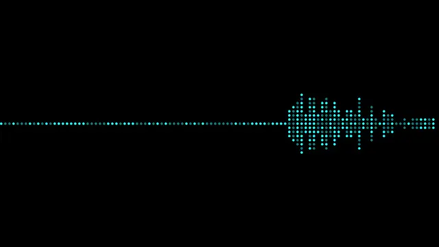

# Dotted Waveform Visualizer Cog Model

This is a simple tool to create a dotted waveform visualizer, as a [Cog](https://github.com/replicate/cog) model.

## Development

Follow the [model pushing guide](https://replicate.com/docs/guides/push-a-model) to push your own model to [Replicate](https://replicate.com).

## How to use

Make sure you have [cog](https://github.com/replicate/cog) installed.

To run a prediction:

    cog predict -i audio_file=@perplexity.mp3

Output

